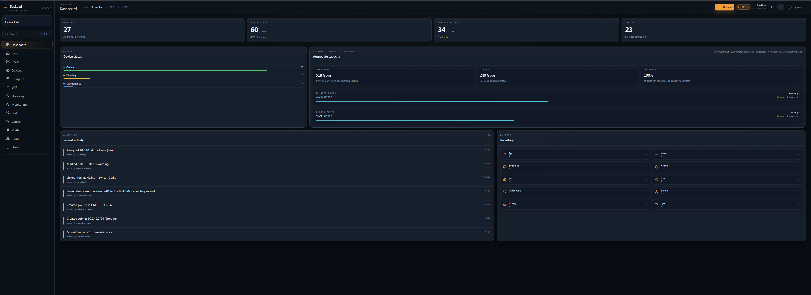
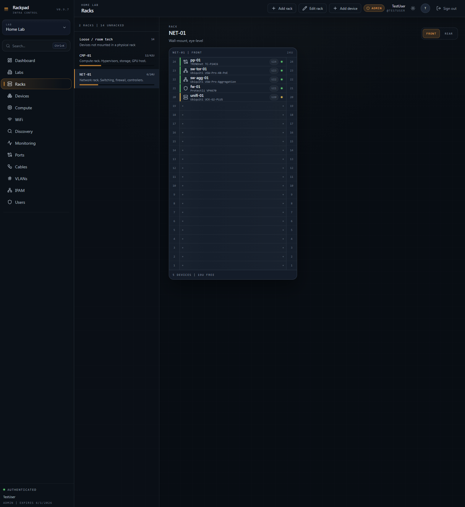
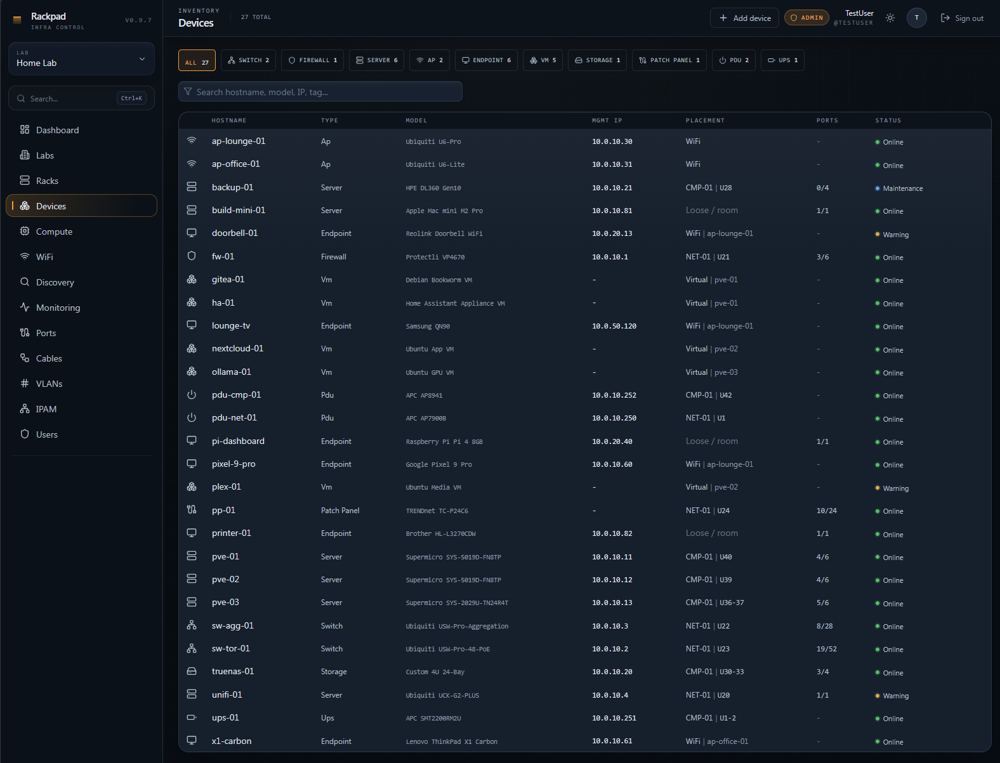
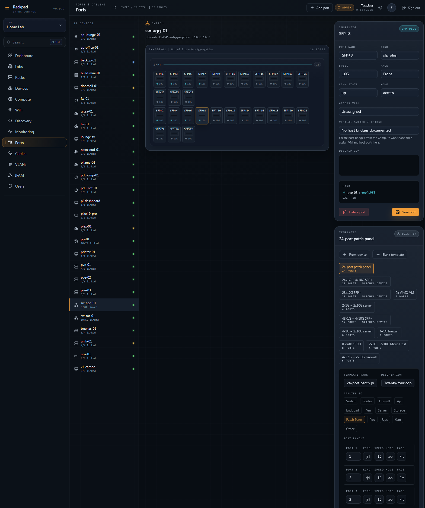
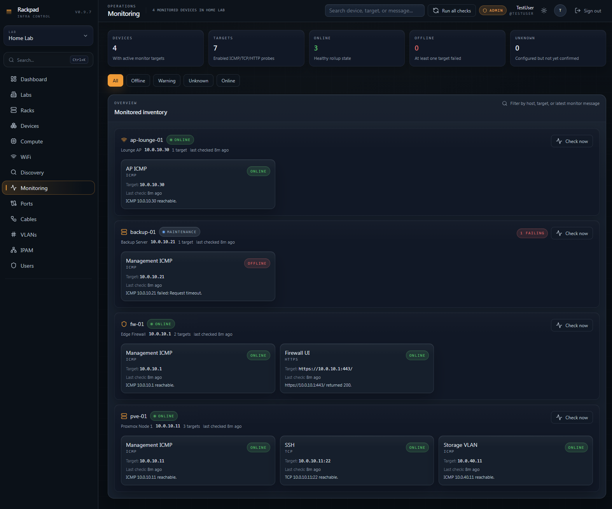
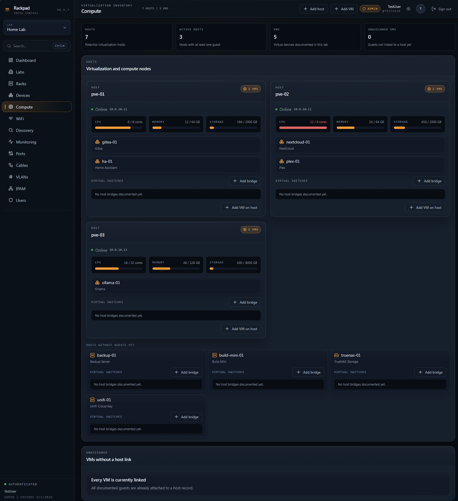
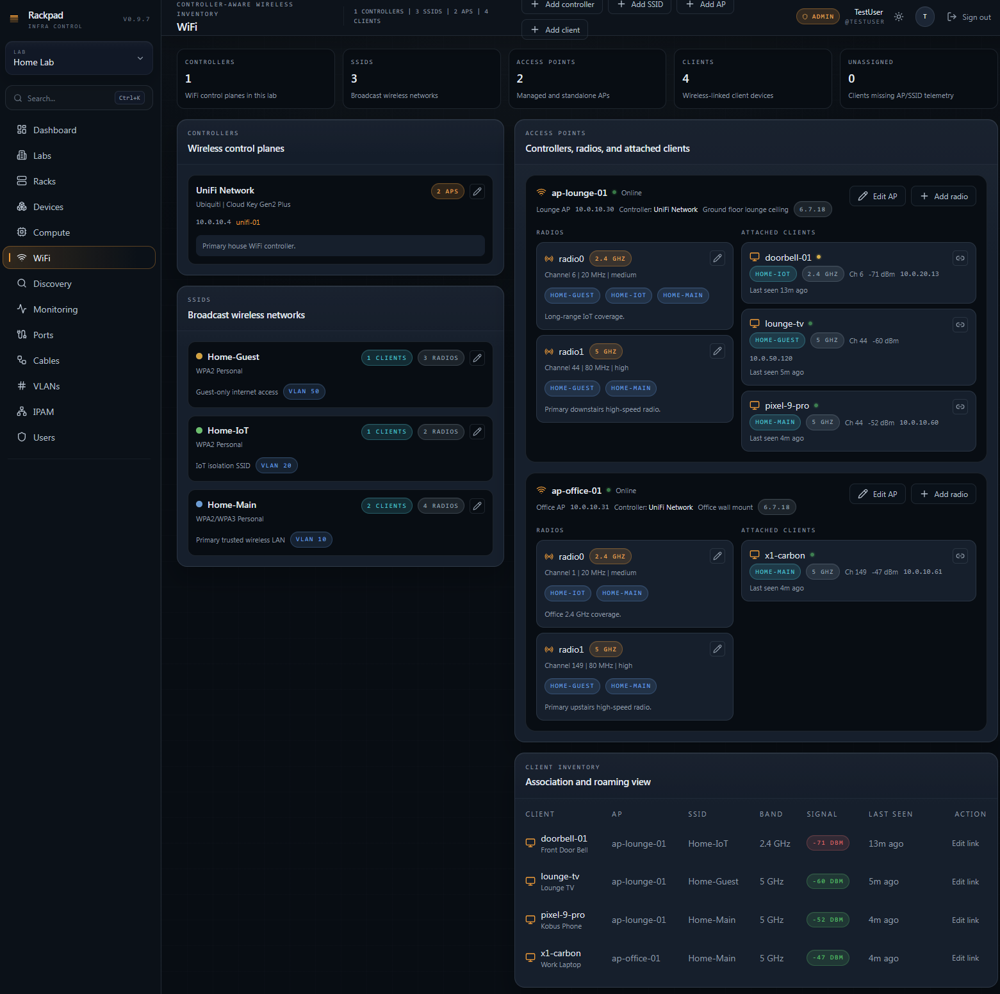
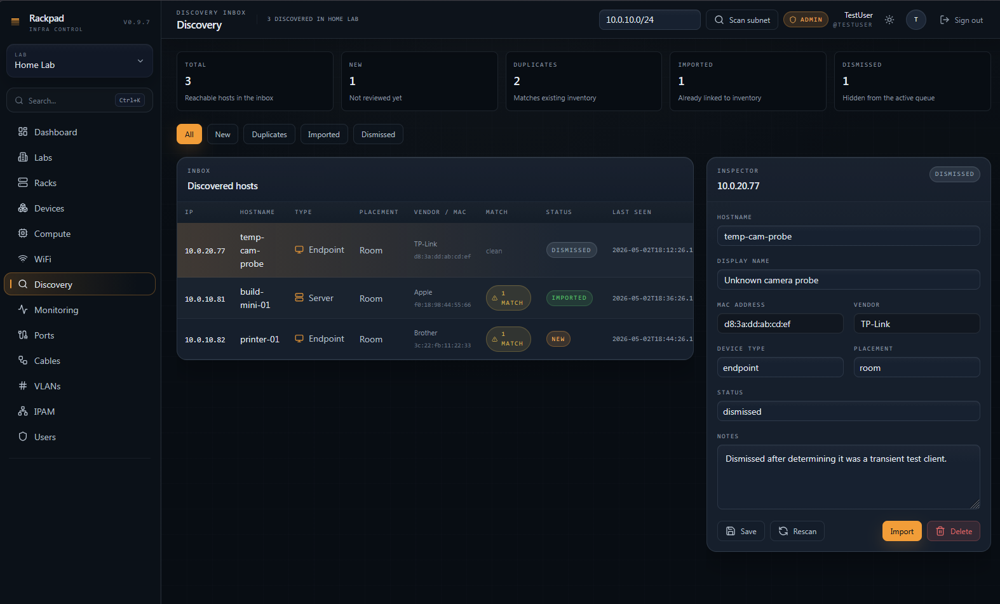
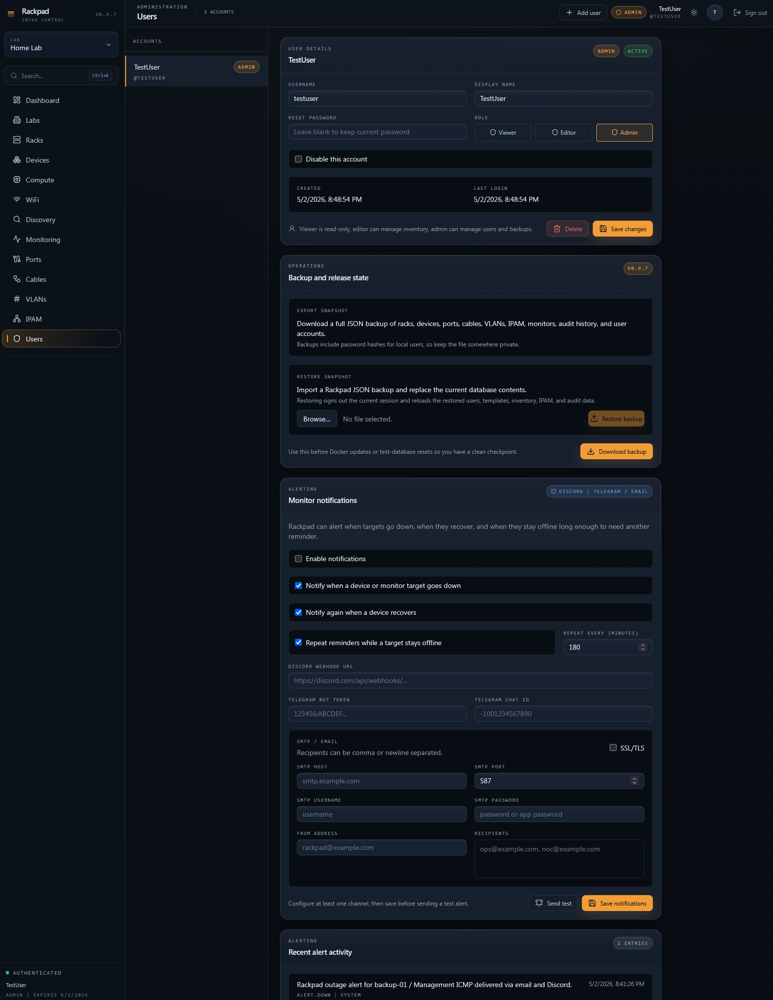

# Rackpad

Rackpad is a self-hosted infrastructure inventory and operations app for racks, devices, ports, cables, VLANs, IP address management, WiFi, compute, discovery, monitoring, labs, and users.

Current release: `v1.1.2`

It is a full-stack app:

- React + Vite frontend
- Fastify API
- SQLite persistence through `better-sqlite3`
- session-based authentication with admin/editor/viewer roles
- per-device health checks with multi-target ICMP, TCP, HTTP, and HTTPS monitor support
- Docker support for a single-container test deployment

## Quick links

If `rackpad.co.za` is unavailable, the repo still contains the core material you need:

- [Installation guide](./INSTALL.md)
- [Proxmox install notes](./docs/PROXMOX.md)
- [Hyper-V import guide](./docs/HYPERV_IMPORT.md)
- [Reports guide](./docs/REPORTS.md)
- [Visualizer guide](./docs/VISUALIZER.md)
- [Security policy](./SECURITY.md)
- [Changelog](./CHANGELOG.md)
- [MIT license](./LICENSE)
- [Support notes](./SUPPORT.md)

## Screenshots

These are live captures from the working Rackpad demo environment, embedded directly in the GitHub repo.

### Overview and physical inventory

| Dashboard                                              | Racks                                               |
| ------------------------------------------------------ | --------------------------------------------------- |
|  |  |

| Devices                                                      | Ports                                                            |
| ------------------------------------------------------------ | ---------------------------------------------------------------- |
|  |  |

### Operations, compute, and wireless

| Monitoring                                                         | Compute                                                      |
| ------------------------------------------------------------------ | ------------------------------------------------------------ |
|  |  |

| WiFi                                                   | Discovery                                                        |
| ------------------------------------------------------ | ---------------------------------------------------------------- |
|  |  |

### Network and address management

| IPAM                                                   |
| ------------------------------------------------------ |
|  |

These are enough to see the app before installing it, and the full screenshot set used for GitHub previews lives in [`docs/screenshots`](./docs/screenshots).

## What you can see before install

From the GitHub repo alone, you can already preview the major Rackpad workspaces:

- Dashboard for inventory, health, capacity, and recent activity
- Racks for physical placement, mounted gear, and room-tech context
- Devices for searchable inventory and placement-aware records
- Ports for switch, host, AP, VM, and patch-panel connectivity
- Compute for hosts, VMs, and virtual switch / bridge membership
- WiFi for controllers, SSIDs, radios, clients, and signal context
- Discovery for staged imports, MAC/vendor hints, and duplicate detection
- Monitoring for multi-target ICMP, TCP, HTTP, and HTTPS checks
- IPAM for subnets, DHCP scopes, IP zones, and linked assignments
- Imports for review-first Hyper-V host and VM onboarding
- Reports for printable/PDF, Excel-compatible, and CSV exports
- Visualizer for rack, loose-room, port, and cable relationship maps

## What works

- Rack inventory and physical placement
- Add, edit, and delete racks
- Add, edit, and delete devices
- Device placement modes for rack, room, wireless, and virtual inventory
- Parent-child device relationships for hosted VMs and AP-linked wireless clients
- Compute workspace for virtualization hosts and VMs
- Capacity tracking for hosts and VMs with CPU, memory, storage, and specs fields
- Port templates for new devices
- Manual port create, edit, and delete
- Create, edit, and delete cables
- VLAN allocation and VLAN deletion
- VLAN range create, edit, and delete
- IPAM subnet, DHCP scope, and IP zone CRUD
- Controller-aware WiFi workspace for controllers, SSIDs, AP radios, and wireless clients
- Wireless client telemetry with AP, SSID, band, channel, signal, last-seen, and roam context
- Discovery inbox with subnet scan, duplicate awareness, review, and import into inventory
- Discovery enrichment with MAC/vendor capture and direct linking to existing inventory
- Management IP synchronization between device records and IPAM
- Next-free IP allocation and IP release
- Audit log writes for the main workflows
- User bootstrap, login, logout, and user management
- Admin-only JSON backup export from the users screen
- Backup exports preserve password hashes for restore, but redact stored alert-delivery secrets before download
- Device health-check configuration, alert destinations, repeat-alert controls, and on-demand monitor runs
- Multiple monitor targets per device so servers, firewalls, and multi-NIC systems can track separate management, service, storage, or VIP endpoints
- SMTP/email alert delivery beside Discord and Telegram, plus recent alert activity in the admin area
- Reports workspace with printable/PDF-friendly inventory summaries plus Excel-compatible and CSV exports
- Visualizer workspace for rack, room-tech, port, and cable relationship mapping
- Hyper-V import wizard for staging hosts, VMs, power state, guest OS, virtual switches, virtual NICs, VLANs, IPs, CPU, memory, and disk data from a local PowerShell export, with editable host mapping before import
- Expanded demo data with multiple labs, discovery states, custom templates, multi-target monitors, room tech, compute, and WiFi examples
- Production build of the frontend and backend
- Docker packaging for the frontend + API together

## Feature guides

Use these when you want the workflow steps rather than just the overview:

- [Hyper-V import](./docs/HYPERV_IMPORT.md): download the collector, collect inventory on a Hyper-V host, map or create the host record, review VMs, and import selected categories.
- [Reports](./docs/REPORTS.md): generate a clean inventory report, print/save to PDF, and export CSV or Excel-compatible files.
- [Visualizer](./docs/VISUALIZER.md): inspect rack, loose-room, port, and cable relationships from existing Rackpad data.

## Versioning

Rackpad uses semantic versioning and Git tags in the form `vX.Y.Z`.

- The app version lives in [package.json](./package.json).
- Release notes live in [CHANGELOG.md](./CHANGELOG.md).
- The `v1.0` rollout checklist lives in [V1_CHECKLIST.md](./V1_CHECKLIST.md).
- Install and deploy examples should pin a version instead of assuming `main`.

Every shipped change should update the version and add a matching changelog entry describing what changed.

## Release channels

Rackpad now uses two long-lived Git branches:

- `main`: stable release branch intended for production and tagged releases
- `beta`: pre-release testing branch for changes that should be validated before they land on `main`

Recommended workflow:

- test new work from `beta`
- merge validated fixes and features into `main`
- create version tags like `v1.1.0` from `main`

If you want the newest testing build instead of the latest stable tag:

```bash
git checkout beta
git pull origin beta
```

## Legal and support files

The repository now also includes:

- the project [LICENSE](./LICENSE)
- copyright and project notices in [NOTICE.md](./NOTICE.md)
- a basic disclosure policy in [SECURITY.md](./SECURITY.md)
- maintainer/support expectations in [SUPPORT.md](./SUPPORT.md)

## Requirements

- Docker Engine with the Compose plugin for normal installs
- Node 22 LTS and npm for development or native installs

The repo includes `.nvmrc`, so if you use `nvm`:

```bash
nvm use
```

## Development

Install dependencies:

```bash
npm install
```

Run the full dev stack:

```bash
npm run dev:all
```

This starts:

- frontend on `http://localhost:5173`
- API on `http://localhost:3000`

The Vite dev server proxies `/api` to the Fastify backend.

## Production build

Build both the frontend and backend:

```bash
npm run build
```

Start the compiled app:

```bash
npm start
```

Default environment variables:

```bash
HOST=0.0.0.0
PORT=3000
DATABASE_PATH=./rackpad.db
MONITOR_INTERVAL_MS=300000
NODE_ENV=production
TRUST_PROXY=0
TRUSTED_HOSTS=
TRUSTED_ORIGINS=
```

## First run

On the first boot there are no users yet.

1. Open Rackpad in the browser.
2. Create the initial admin account.
3. Sign in.
4. Choose whether to start empty or preload the expanded demo environment.
5. Start documenting racks, devices, VLANs, and IPAM.

## Install With Docker

Recommended no-clone install from the published GHCR image:

```bash
sudo apt-get update
sudo apt-get install -y curl ca-certificates
curl -fsSL https://raw.githubusercontent.com/Kobii-git/Rackpad/main/scripts/install-docker.sh | bash
```

Use `RACKPAD_TAG=latest` if you want the newest stable GHCR image, or pin an
exact Docker tag such as `1.1.2` when you want controlled production upgrades:

```bash
curl -fsSL https://raw.githubusercontent.com/Kobii-git/Rackpad/main/scripts/install-docker.sh -o /tmp/install-rackpad.sh
RACKPAD_TAG=latest bash /tmp/install-rackpad.sh
```

Open:

```text
http://SERVER_IP:3000
```

Manual no-clone compose install:

```bash
sudo mkdir -p /opt/rackpad
cd /opt/rackpad
sudo curl -fsSLo compose.yml https://raw.githubusercontent.com/Kobii-git/Rackpad/main/docker-compose.release.yml
sudo tee .env >/dev/null <<'EOF'
RACKPAD_IMAGE=ghcr.io/kobii-git/rackpad
RACKPAD_TAG=1.1.2
RACKPAD_PORT=3000
MONITOR_INTERVAL_MS=300000
TRUST_PROXY=0
TRUSTED_HOSTS=
TRUSTED_ORIGINS=
EOF
sudo docker compose pull
sudo docker compose up -d
```

Build locally from a cloned repo only if you want to build from source:

```bash
docker compose up --build -d
```

The compose stack:

- exposes Rackpad on `${RACKPAD_PORT:-3000}`
- stores SQLite data in the named volume `rackpad_data`
- serves the compiled frontend and API from the same container
- runs with a read-only root filesystem except for `/data` and `/tmp`
- uses `/api/health` for the container health check

To stop it:

```bash
docker compose down
```

To stop it and remove the database volume:

```bash
docker compose down -v
```

Full Linux, Proxmox, and Windows install details, plus update steps, backups,
git-clone/source-build options, and reverse-proxy settings live in
[INSTALL.md](./INSTALL.md).

## Linux test deploy

For a simple non-Docker Linux test deploy:

```bash
npm install
npm run build
PORT=3000 HOST=0.0.0.0 DATABASE_PATH=./rackpad.db npm start
```

If `better-sqlite3` needs to compile during `npm install`, install build tools first:

```bash
sudo apt-get update
sudo apt-get install -y python3 make g++
```

## Reverse proxy / TLS

For any public-facing or VPN-exposed deployment, put Rackpad behind a TLS reverse proxy and set the trusted proxy/origin environment values.

Recommended environment shape:

```bash
TRUST_PROXY=1
TRUSTED_HOSTS=rackpad.example.com
TRUSTED_ORIGINS=https://rackpad.example.com
```

Example proxy files are included in:

- [deploy/Caddyfile.example](./deploy/Caddyfile.example)
- [deploy/nginx-rackpad.conf](./deploy/nginx-rackpad.conf)

The app already sets:

- `Content-Security-Policy`
- `Strict-Transport-Security` when the request arrives over HTTPS
- `X-Frame-Options`
- `X-Content-Type-Options`
- `Referrer-Policy`

So the main deployment job is to terminate TLS, forward the correct `X-Forwarded-*` headers, and keep Rackpad reachable only through the hostname you trust.

## Windows note

On this Windows machine, the app builds and lints cleanly, but the local runtime is still blocked under Node 24 because `better-sqlite3` does not have a matching native binding installed.

The intended local fix is:

- switch to Node 22
- rerun `npm install`

Linux and Docker remain the preferred validation paths.

## Quality checks

These are wired into the repo now:

```bash
npm run build
npm run lint
npm run test:server
```

`npm run test:server` is expected to work on Linux/Node 22 or any environment where `better-sqlite3` can load successfully.

## Project layout

```text
rackpad/
|- docs/screenshots/       GitHub-friendly app screenshots
|- server/                 Fastify API, SQLite schema, seed data, routes, tests
|- src/
|  |- components/          UI and feature components
|  |- lib/                 typed API client, store, types, helpers
|  |- pages/               route-level screens
|- dist/                   built frontend
|- dist-server/            built backend
|- Dockerfile              production container build
|- docker-compose.yml      local container orchestration
```

Full step-by-step setup instructions are in [INSTALL.md](./INSTALL.md).
Version-by-version release notes are in [CHANGELOG.md](./CHANGELOG.md).
